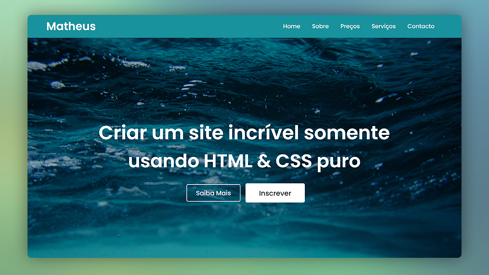

# SITE INCLIVEL
😎ESTE É UM ÓTIMO PONTO DE PARTIDA PARA CRIAR UM SITE PROFISSIONAL E ATRATIVO COM RECURSOS BÁSICOS DE NAVEGAÇÃO E DESTAQUE VISUAL.

  

## DESCRIÇÃO:
Este site é um exemplo simples e atrativo de uma página criada utilizando apenas **HTML** e **CSS puro**. Ele demonstra como construir um layout moderno e responsivo com navegação e uma seção de banner de destaque.

## FUNCIONALIDADES:
1. **Navegação:**
   - No topo da página, há um menu de navegação com links para diferentes seções, como **Home**, **Sobre**, **Preços**, **Serviços** e **Contato**. Esses links podem ser ajustados conforme as páginas que você deseja adicionar ao seu site.

2. **Banner de Destaque:**
   - A seção principal contém um banner de tela cheia com um título e subtítulo. Você pode editar o texto para destacar os principais serviços ou produtos que deseja promover.
   - Há dois botões interativos: **Saiba Mais** e **Inscrever**. O estilo dos botões é animado, com um deles vibrando sutilmente para chamar atenção. Você pode vincular esses botões a outras páginas ou ações, como inscrições ou mais informações sobre seus serviços.

3. **Estilo e Aparência:**
   - O design utiliza uma fonte moderna e limpa (Poppins), e cores vibrantes, com destaque para o azul (#18929D) no menu e o branco no texto e botões. 
   - O fundo do banner possui uma imagem (personalizável) com um efeito de gradiente escuro, criando contraste e dando um ar profissional ao layout.
   - O menu e os botões possuem transições suaves, que proporcionam uma experiência interativa agradável para o usuário.

4. **Responsividade:**
   - O site é otimizado para visualização em diferentes dispositivos. A estrutura flexível do layout garante que o conteúdo se ajuste bem a qualquer tamanho de tela.

## NÃO SABE?
- Entendemos que para manipular arquivos em `HTML`, `CSS` e outras linguagens relacionadas, é necessário possuir conhecimento nessas áreas. Para auxiliar nesse aprendizado, oferecemos cursos gratuitos disponíveis:
* [CURSO DE HTML E CSS](https://github.com/VILHALVA/CURSO-DE-HTML-E-CSS)
* [CONFIRA MAIS CURSOS](https://github.com/VILHALVA?tab=repositories&q=+topic:CURSO)

## CREDITOS:
- [PROJETO CRIADO PELO "matheusmanuel"](https://github.com/matheusmanuel/site-simples-com-html-e-css-)
- [VEJA O VIDEO DESSE PROJETO](https://www.youtube.com/watch?v=3R7QtNcwE3c)
- [PROJETO EDITADO PELO VILHALVA](https://github.com/VILHALVA)

